<table border="0">
  <tr>
    <td width="70%" valign="top">
      <div align="center">
        <h1>Undefined</h1>
        <em>A high-performance, highly scalable QQ group and private chat robot based on a self-developed architecture.</em>
        <br/><br/>
        <a href="https://www.python.org/"></a>
        <a href="LICENSE"></a>
        <a href="https://deepwiki.com/69gg/Undefined"></a>
        <br/><br/>
        <p>大鹏一日同风起，扶摇直上九万里。</p>
      </div>
      <h3>项目简介</h3>
      <p>
        <strong>Undefined</strong> 是一个功能强大的 QQ 机器人平台，采用全新的 <strong>自研 Skills</strong> 架构。基于现代 Python 异步技术栈构建，它不仅提供基础的对话能力，更通过内置的多个智能 Agent 实现代码分析、网络搜索、娱乐互动等多模态能力。
      </p>
    </td>
    <td width="30%">
      
    </td>
  </tr>
</table>

### _与 [NagaAgent](https://github.com/Xxiii8322766509/NagaAgent) 进行联动！_

---

<details>
<summary><b>目录</b></summary>

- [立即体验](#立即体验)
- [核心特性](#核心特性)
- [安装与部署](#安装与部署)
  - [源码部署（开发/使用）](#源码部署开发使用)
  - [配置说明](#配置说明)
  - [MCP 配置](#mcp-配置)
- [技术架构](#技术架构)
  - [Skills 插件系统](#skills-插件系统)
  - ["车站-列车" 队列模型](#车站-列车-队列模型)
- [使用说明](#使用说明)
  - [开始使用](#开始使用)
  - [Agent 能力展示](#agent-能力展示)
  - [管理员命令](#管理员命令)
- [扩展与开发](#扩展与开发)
- [致谢与友链](#致谢与友链)
- [开源协议](#开源协议)

</details>

---

## 立即体验

[点击添加官方实例QQ](https://qm.qq.com/q/cvjJoNysGA)

## 核心特性

- **Skills 架构**：全新设计的技能系统，将基础工具（Tools）与智能代理（Agents）分层管理，支持自动发现与注册。
- **Skills 热重载**：自动扫描 `skills/` 目录，检测到变更后即时重载工具与 Agent，无需重启服务。
- **配置热更新 + WebUI**：使用 `config.toml` 配置，支持热更新；提供 WebUI 在线编辑与校验。
- **并行工具执行**：无论是主 AI 还是子 Agent，均支持 `asyncio` 并发工具调用，大幅提升多任务处理速度（如同时读取多个文件或搜索多个关键词）。
- **智能 Agent 矩阵**：内置多个专业 Agent，分工协作处理复杂任务。
- **Agent 自我介绍自动生成**：启动时按 Agent 代码/配置 hash 生成 `intro.generated.md`（第一人称、结构化），与 `intro.md` 合并后作为描述；减少手动维护，保持能力说明与实现同步，有助于精准调度。
- **请求上下文管理**：基于 Python `contextvars` 的统一请求上下文系统，自动 UUID 追踪，零竞态条件，完全的并发隔离。
- **定时任务系统**：支持 Crontab 语法的强大定时任务系统，可自动执行各种操作（如定时提醒、定时搜索）。
- **MCP 协议支持**：支持通过 MCP (Model Context Protocol) 连接外部工具和数据源，扩展 AI 能力。
- **Agent 私有 MCP**：可为单个 agent 提供独立 MCP 配置，按调用即时加载并释放，工具仅对该 agent 可见。
- **思维链支持**：支持开启思维链，提升复杂逻辑推理能力。
- **高并发架构**：基于 `asyncio` 全异步设计，支持多队列消息处理与工具并发执行，轻松应对高并发场景。
- **异步安全 I/O**：建立统一 IO 层，通过线程池和文件锁（`flock`）确保底层磁盘操作永不阻塞主事件循环，彻底杜绝死锁。
- **安全防护**：内置独立的安全模型，实时检测注入攻击与恶意内容。
- **OneBot 协议**：完美兼容 OneBot V11 协议，支持多种前端实现（如 NapCat）。

## 系统架构概览

Undefined 采用 **8层异步架构设计**，以下是详细的系统架构图（包含所有核心组件、6个Agent、7类工具集、存储系统与数据流）：

```mermaid
graph TB
    %% ==================== 外部实体层 ====================
    User([用户 User])
    Admin([管理员 Admin])
    OneBotServer["OneBot 协议端<br/>(NapCat / Lagrange.Core)"]
    LLM_API["大模型 API 服务商<br/>(OpenAI / Claude / DeepSeek / etc.)"]

    %% ==================== 核心入口层 ====================
    subgraph EntryPoint["核心入口层 (src/Undefined/)"]
        Main["main.py<br/>启动入口"]
        ConfigLoader["ConfigManager<br/>配置管理器<br/>[config/manager.py + loader.py]"]
        ConfigModels["配置模型<br/>[config/models.py]<br/>ChatModelConfig<br/>VisionModelConfig<br/>SecurityModelConfig<br/>AgentModelConfig"]
        OneBotClient["OneBotClient<br/>WebSocket 客户端<br/>[onebot.py]"]
        Context["RequestContext<br/>请求上下文<br/>[context.py]"]
        WebUI["webui.py<br/>配置控制台<br/>[src/Undefined/webui.py]"]
    end

    %% ==================== 消息处理层 ====================
    subgraph MessageLayer["消息处理层"]
        MessageHandler["MessageHandler<br/>消息处理器<br/>[handlers.py]"]
        SecurityService["SecurityService<br/>安全服务<br/>• 注入检测 • 速率限制<br/>[security.py]"]
        CommandDispatcher["CommandDispatcher<br/>命令分发器<br/>• /help /stats /lsadmin<br/>• /addadmin /rmadmin<br/>[services/command.py]"]
        AICoordinator["AICoordinator<br/>AI 协调器<br/>• Prompt 构建 • 队列管理<br/>• 回复执行<br/>[ai_coordinator.py]"]
        QueueManager["QueueManager<br/>队列管理器<br/>[queue_manager.py]"]
    end

    %% ==================== AI 核心能力层 ====================
    subgraph AILayer["AI 核心能力层 (src/Undefined/ai/)"]
        AIClient["AIClient<br/>AI 客户端主入口<br/>[client.py]<br/>• 技能热重载 • MCP 初始化<br/>• Agent intro 生成"]
        PromptBuilder["PromptBuilder<br/>提示词构建器<br/>[prompts.py]"]
        ModelRequester["ModelRequester<br/>模型请求器<br/>[llm.py]<br/>• OpenAI SDK • 工具清理<br/>• Thinking 提取"]
        ToolManager["ToolManager<br/>工具管理器<br/>[tooling.py]<br/>• 工具执行 • Agent 工具合并<br/>• MCP 工具注入"]
        MultimodalAnalyzer["MultimodalAnalyzer<br/>多模态分析器<br/>[multimodal.py]"]
        SummaryService["SummaryService<br/>总结服务<br/>[summaries.py]"]
        TokenCounter["TokenCounter<br/>Token 统计<br/>[tokens.py]"]
    end

    %% ==================== 存储与上下文层 ====================
    subgraph StorageLayer["存储与上下文层"]
        HistoryManager["MessageHistoryManager<br/>消息历史管理<br/>[utils/history.py]<br/>• 懒加载 • 10000条限制"]
        MemoryStorage["MemoryStorage<br/>长期记忆存储<br/>[memory.py]<br/>• 500条上限 • 自动去重"]
        EndSummaryStorage["EndSummaryStorage<br/>短期总结存储<br/>[end_summary_storage.py]"]
        FAQStorage["FAQStorage<br/>FAQ 存储<br/>[faq.py]"]
        ScheduledTaskStorage["ScheduledTaskStorage<br/>定时任务存储<br/>[scheduled_task_storage.py]"]
        TokenUsageStorage["TokenUsageStorage<br/>Token 使用统计<br/>[token_usage_storage.py]<br/>• 自动归档 • gzip 压缩"]
    end

    %% ==================== 技能系统层 ====================
    subgraph SkillsLayer["Skills 技能系统 (src/Undefined/skills/)"]
        ToolRegistry["ToolRegistry<br/>工具注册表<br/>[registry.py]<br/>• 延迟加载 • 热重载支持<br/>• 执行统计"]
        AgentRegistry["AgentRegistry<br/>Agent 注册表<br/>[registry.py]<br/>• Agent 发现 • 工具聚合"]
        
        subgraph AtomicTools["基础工具"]
            T_End["end<br/>结束对话"]
            T_Python["python_interpreter<br/>Python 解释器"]
            T_Time["get_current_time<br/>获取当前时间"]
        end
        
        subgraph Toolsets["工具集 (7大类)"]
            TS_Group["group.*<br/>• get_member_list<br/>• get_member_info<br/>• get_honor_info<br/>• get_files"]
            TS_Messages["messages.*<br/>• send_message<br/>• get_recent_messages<br/>• get_forward_msg"]
            TS_Memory["memory.*<br/>• add / delete<br/>• list / update"]
            TS_Notices["notices.*<br/>• list / get / stats"]
            TS_Render["render.*<br/>• render_html<br/>• render_latex<br/>• render_markdown"]
            TS_Scheduler["scheduler.*<br/>• create_schedule_task<br/>• delete_schedule_task<br/>• list_schedule_tasks"]
        end
        
        subgraph IntelligentAgents["智能体 Agents (6个)"]
            A_Info["info_agent<br/>信息查询助手<br/>(15个工具)<br/>• weather_query<br/>• *hot 热搜<br/>• gold_price<br/>• whois"]
            A_Social["social_agent<br/>社交媒体助手<br/>(8个工具)<br/>• bilibili_search<br/>• music_*<br/>• video_recommend"]
            A_Web["web_agent<br/>网络搜索助手<br/>• MCP Playwright<br/>• web_search<br/>• crawl_webpage"]
            A_File["file_analysis_agent<br/>文件分析助手<br/>(14个工具)<br/>• extract_* (PDF/Word/Excel/PPT)<br/>• analyze_code<br/>• analyze_multimodal"]
            A_Naga["naga_code_analysis_agent<br/>NagaAgent 代码分析<br/>(7个工具)<br/>• read_file / glob<br/>• search_file_content"]
            A_Ent["entertainment_agent<br/>娱乐助手<br/>(10个工具)<br/>• ai_draw_one<br/>• horoscope<br/>• novel_search"]
        end
        
        MCPRegistry["MCPToolRegistry<br/>MCP 工具注册表<br/>[mcp/registry.py]"]
    end

    %% ==================== IO 工具层 ====================
    subgraph IOLayer["异步 IO 层 (utils/io.py)"]
        IOUtils["IO 工具<br/>• write_json • read_json<br/>• append_line<br/>• 文件锁 (flock)"]
    end

    %% ==================== 数据持久化层 ====================
    subgraph Persistence["数据持久化层 (data/)"]
        Dir_History["history/<br/>• group_{id}.json<br/>• private_{id}.json"]
        Dir_FAQ["faq/{group_id}/<br/>• YYYYMMDD-NNN.json"]
        Dir_TokenUsage["token_usage_archives/<br/>• *.jsonl.gz"]
        File_Config["config.toml<br/>config.local.json"]
        File_Memory["memory.json<br/>(长期记忆)"]
        File_EndSummary["end_summaries.json<br/>(短期总结)"]
        File_ScheduledTasks["scheduled_tasks.json<br/>(定时任务)"]
    end

    %% ==================== 连接线 ====================
    %% 外部实体到核心入口
    User -->|"消息"| OneBotServer
    Admin -->|"指令"| OneBotServer
    OneBotServer <-->|"WebSocket<br/>Event / API"| OneBotClient
    
    %% 核心入口层内部
    Main -->|"初始化"| ConfigLoader
    Main -->|"创建"| OneBotClient
    Main -->|"创建"| AIClient
    ConfigLoader --> ConfigModels
    ConfigLoader -->|"读取"| File_Config
    WebUI -->|"读写"| File_Config
    OneBotClient -->|"消息事件"| MessageHandler
    
    %% 消息处理层
    MessageHandler -->|"1. 安全检测"| SecurityService
    SecurityService -.->|"API 调用"| LLM_API
    
    MessageHandler -->|"2. 指令?"| CommandDispatcher
    CommandDispatcher -->|"执行结果"| OneBotClient
    
    MessageHandler -->|"3. 自动回复"| AICoordinator
    AICoordinator -->|"创建上下文"| Context
    AICoordinator -->|"入队"| QueueManager
    QueueManager -->|"1Hz 发车<br/>异步执行"| AIClient
    
    %% AI 核心能力层
    AIClient --> PromptBuilder
    AIClient --> ModelRequester
    AIClient --> ToolManager
    AIClient --> MultimodalAnalyzer
    AIClient --> SummaryService
    AIClient --> TokenCounter
    
    ModelRequester <-->|"API 请求"| LLM_API
    
    %% 存储层连接
    PromptBuilder -->|"注入"| HistoryManager
    PromptBuilder -->|"注入"| MemoryStorage
    PromptBuilder -->|"注入"| EndSummaryStorage
    
    MessageHandler -->|"保存消息"| HistoryManager
    AICoordinator -->|"记录统计"| TokenUsageStorage
    CommandDispatcher -->|"FAQ 操作"| FAQStorage
    
    %% 技能系统层
    ToolManager -->|"获取工具"| ToolRegistry
    ToolManager -->|"获取 Agent"| AgentRegistry
    ToolManager -->|"获取 MCP"| MCPRegistry
    
    ToolRegistry --> AtomicTools
    ToolRegistry --> Toolsets
    AgentRegistry --> IntelligentAgents
    
    %% IO 层连接
    HistoryManager -->|"异步读写"| IOUtils
    MemoryStorage -->|"异步读写"| IOUtils
    TokenUsageStorage -->|"异步读写<br/>自动归档"| IOUtils
    FAQStorage -->|"异步读写"| IOUtils
    ScheduledTaskStorage -->|"异步读写"| IOUtils
    
    IOUtils --> Dir_History
    IOUtils --> File_Memory
    IOUtils --> File_EndSummary
    IOUtils --> Dir_TokenUsage
    IOUtils --> Dir_FAQ
    IOUtils --> File_ScheduledTasks
    
    %% Agent 递归调用
    IntelligentAgents -->|"递归调用"| AIClient
    
    %% 最终输出
    AIClient -->|"Reply Text"| OneBotClient
    OneBotClient -->|"发送"| OneBotServer
    
    %% 样式定义
    classDef external fill:#ffebee,stroke:#c62828,stroke-width:2px
    classDef core fill:#e3f2fd,stroke:#1565c0,stroke-width:2px
    classDef message fill:#fff3e0,stroke:#ef6c00,stroke-width:2px
    classDef ai fill:#f3e5f5,stroke:#6a1b9a,stroke-width:2px
    classDef skills fill:#e8f5e9,stroke:#2e7d32,stroke-width:2px
    classDef storage fill:#e0f7fa,stroke:#00838f,stroke-width:2px
    classDef io fill:#fce4ec,stroke:#c2185b,stroke-width:1px
    classDef persistence fill:#f5f5f5,stroke:#616161,stroke-width:1px
    
    class User,Admin,OneBotServer,LLM_API external
    class Main,ConfigLoader,ConfigModels,OneBotClient,Context,WebUI core
    class MessageHandler,SecurityService,CommandDispatcher,AICoordinator,QueueManager message
    class AIClient,PromptBuilder,ModelRequester,ToolManager,MultimodalAnalyzer,SummaryService,TokenCounter ai
    class ToolRegistry,AgentRegistry,MCPRegistry,AtomicTools,Toolsets,IntelligentAgents skills
    class HistoryManager,MemoryStorage,EndSummaryStorage,FAQStorage,ScheduledTaskStorage,TokenUsageStorage storage
    class IOUtils io
    class Dir_History,Dir_FAQ,Dir_TokenUsage,File_Config,File_Memory,File_EndSummary,File_ScheduledTasks persistence
```



> 详细介绍请见[ARCHITECTURE.md](ARCHITECTURE.md)

---

## 安装与部署

我将持续优化安装体验。目前推荐使用源码部署，方便进行个性化配置和二次开发。

### 源码部署（开发/使用）

#### 1. 克隆项目

由于项目中使用了 `NagaAgent` 作为子模块，请使用以下命令克隆项目：

```bash
git clone --recursive https://github.com/69gg/Undefined.git
cd Undefined
```

如果已经克隆了项目但没有初始化子模块：

```bash
git submodule update --init --recursive
```

#### 2. 安装依赖

推荐使用 `uv` 进行现代化的 Python 依赖管理（速度极快）：

```bash
# 安装 uv (如果尚未安装)
pip install uv

# 同步依赖
uv sync
```

同时需要安装 Playwright 浏览器内核（用于网页浏览功能）：

```bash
uv run playwright install
```

#### 3. 配置环境

复制示例配置文件 `config.toml.example` 为 `config.toml` 并填写你的配置信息。

```bash
cp config.toml.example config.toml
```

#### 4. 启动运行

```bash
uv run Undefined
```

如需 WebUI（配置编辑控制台）：

```bash
uv run Undefined-webui
```

### 配置说明

在 `config.toml` 文件中配置以下核心参数（示例见 `config.toml.example`）：

- **基础配置**：`[core]` 与 `[onebot]`
- **模型配置**：`[models.chat]` / `[models.vision]` / `[models.agent]` / `[models.security]`
  - `api_url`：OpenAI 兼容 **base URL**（如 `https://api.openai.com/v1` / `http://127.0.0.1:8000/v1`）
  - DeepSeek Thinking + Tool Calls：若使用 `deepseek-reasoner` 或 `deepseek-chat` + `thinking={"type":"enabled"}` 且启用了工具调用，建议启用 `deepseek_new_cot_support`
- **日志配置**：`[logging]`
- **Token 统计归档**：`[token_usage]`（默认 5MB，<=0 禁用）
- **Skills 热重载**：`[skills]`
- **代理设置（可选）**：`[proxy]`
- **WebUI**：`[webui]`（默认 `127.0.0.1:8787`，密码默认 `changeme`，启动 `uv run Undefined-webui`）

管理员动态列表仍使用 `config.local.json`（自动读写）。

> 旧的`.env` 仍可作为临时兼容输入，但已不推荐使用。
>
> Windows 用户注意：`config.toml` 里的路径不要直接写 `D:\xxx\yyy`（反斜杠会被当作转义）。推荐用 `D:/xxx/yyy`，或用单引号：`'D:\xxx\yyy'`，或在双引号里写双反斜杠：`"D:\\xxx\\yyy"`。

WebUI 支持：配置分组表单快速编辑、Diff 预览、日志尾部查看（含自动刷新）。

> 启动项目需要 OneBot 协议端，推荐使用 [NapCat](https://napneko.github.io/) 或 [Lagrange.Core](https://github.com/LagrangeDev/Lagrange.Core)。

### MCP 配置

Undefined 支持 **MCP (Model Context Protocol)** 协议，可以连接外部 MCP 服务器来无限扩展 AI 的能力（如访问文件系统、数据库、Git 等）。

1. 复制配置示例：`cp config/mcp.json.example config/mcp.json`
2. 编辑 `config/mcp.json`，添加你需要的 MCP 服务器。
3. 在 `config.toml` 中设置：`[mcp].config_path = "config/mcp.json"`

**示例：文件系统访问**

```json
{
  "mcpServers": {
    "filesystem": {
      "command": "npx",
      "args": ["-y", "@modelcontextprotocol/server-filesystem", "/path/to/files"]
    }
  }
}
```

更多资源请访问 [MCP 官方文档](https://modelcontextprotocol.io/) 或 [mcp.so](https://mcp.so) 发现更多服务器。

#### Agent 私有 MCP（可选）

除了全局 MCP 配置外，每个 agent 也支持单独的 MCP 配置文件。若存在，将在调用该 agent 时**临时加载**，并在调用结束后释放，工具仅对该 agent 可见（工具名为 MCP 原始名称，无额外前缀）。此方式无需设置 `MCP_CONFIG_PATH`。

- 路径：`src/Undefined/skills/agents/<agent_name>/mcp.json`
- 示例：`web_agent` 已预置 Playwright MCP（用于网页浏览/截图类能力）

```json
{
  "mcpServers": {
    "playwright": {
      "command": "npx",
      "args": ["@playwright/mcp@latest"]
    }
  }
}
```

## 使用说明

### 开始使用

1. 启动 OneBot 协议端（如 NapCat）并登录 QQ。
2. 配置好 `config.toml` 并启动 Undefined。
3. 连接成功后，机器人即可在群聊或私聊中响应。

### Agent 能力展示

机器人通过自然语言理解用户意图，自动调度相应的 Agent：

*   **网络搜索**："搜索一下 DeepSeek 的最新动态"
*   **代码分析**："分析 src/main.py 的代码逻辑"
*   **娱乐互动**："画一张赛博朋克风格的猫"
*   **定时任务**："每天早上 8 点提醒我看新闻"

### 管理员命令

在群聊或私聊中使用以下指令（需要管理员权限）：

```bash
/help               # 查看帮助菜单
/lsadmin            # 查看管理员列表
/addadmin <QQ>      # 添加管理员（仅超级管理员）
/rmadmin <QQ>       # 移除管理员
/bugfix <QQ>        # 生成指定用户的 Bug 修复报告
```

## 扩展与开发

Undefined 欢迎开发者参与共建！

*   **目录结构**:
    ```
    src/Undefined/
    ├── ai/            # AI Runtime (client、prompt、tooling、summary、多模态)
    ├── skills/        # 技能插件核心目录
    ├── services/      # 核心服务 (Queue, Command, Security)
    ├── utils/         # 通用工具
    ├── handlers.py    # 消息处理层
    └── onebot.py      # OneBot WebSocket 客户端
    ```

*   **开发指南**: 请参考 [src/Undefined/skills/README.md](src/Undefined/skills/README.md) 了解如何编写新的工具和 Agent。

## 致谢与友链

### NagaAgent

本项目集成 **NagaAgent** 子模块。Undefined 诞生于 NagaAgent 社区，感谢作者及社区的支持。

> [NagaAgent - A simple yet powerful agent framework.](https://github.com/Xxiii8322766509/NagaAgent)

## 开源协议

本项目遵循 [MIT License](LICENSE) 开源协议。

<div align="center">
  <strong>⭐ 如果这个项目对您有帮助，请考虑给我们一个 Star</strong>
</div>
